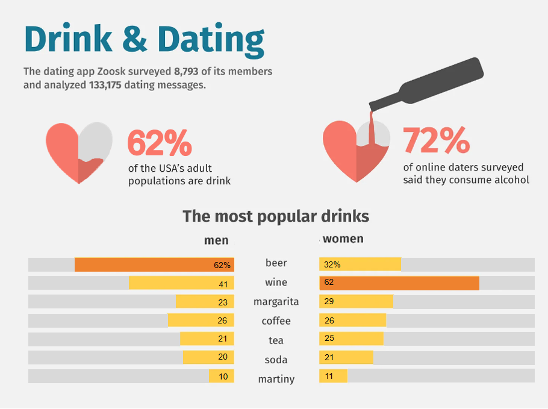

| [home page](https://chengyiing.github.io/cheng-dataviz-portfolio/) | [data viz examples](dataviz-examples) | [critique by design](critique-by-design) | [final project I](final-project-part-one) | [final project II](final-project-part-two) | [final project III](final-project-part-three) |

# Alcohol on Dates: Redesigning Zoosk’s Visualization

## Step one: the visualization 
The original graph I reviewed was created by Zoosk, showcasing people's attitudes towards alcohol on dates. Here's the link: [Zoosk's work](https://www.behance.net/gallery/90626275/Drink-Dating-Infographics)

## Step two: the critique
I was immediately drawn to its unique and fancy design, featuring symbols like hearts and wine bottles, which are visually engaging and align well with the topic. Additionally, the low saturation of colors made the visualization comfortable to look at. 

However, upon closer inspection, I found several issues:
- Color Usage: The colors used didn’t effectively highlight key information. For example, the two largest percentages (65% and 72%) were assigned different colors without any clear reasoning, and the "most popular" drinks weren’t emphasized using darker or standout colors.
- Proportions and Percentages: The visual representation of percentages was confusing. For instance, the filled proportions of hearts were hard to interpret, and the bar chart exaggerated certain values (e.g., 62% was visually scaled to 90%).

These problems motivated me to redesign the graph to improve clarity and storytelling.

## Step three: Sketch a solution

According to my critique, I began by sketching out ideas for my redesign.

After finishing it, I conducted interviews with three teammates to gather feedback.

## Step four: Test the solution

My questions to ask are like: 
- Can you describe to me what this is telling you?
- Is there anything you find surprising or confusing?
- Is there anything you would change or do differently?

Results: 
- Interviewee 1 (MEIM): Highlighted confusion about the data source. We realized that the total percentages exceeded 100%, likely because respondents could select multiple options in the survey. This insight led me to add a note below my redesigned graph to clarify this point.
- Interviewees 2 & 3 (MISM): Suggested replacing split bars with grouped columns for better comparison. They wanted ascending order applied consistently for both genders but acknowledged that differing "most popular" drinks between men and women made this challenging. I ultimately adopted their advice on grouped columns for improved presentation.
- Professor Feedback: Emphasized prioritizing information clarity over artistic elements and stressed identifying a specific audience for the visualization.

## Step five: build the solution

<iframe title="                       The most popular drinks by gender (%)" aria-label="Grouped Columns" id="datawrapper-chart-dTxEp" src="https://datawrapper.dwcdn.net/dTxEp/1/" scrolling="no" frameborder="0" style="width: 0; min-width: 100% !important; border: none;" height="461" data-external="1"></iframe>

For my final graph, I chose a grouped column chart:
- Colors: Blue represents men, pink represents women, while grey highlights the "most popular" drink types for each gender.
- Title: Updated to ensure clarity regarding the data's scope and focus.
- Note: Added below the chart to explain that respondents could select multiple options, addressing confusion about percentages exceeding 100%.
- Simplification: Removed repeated "%" symbols for cleaner visuals.

This redesign aimed to make comparisons between genders more intuitive while emphasizing key insights. Compared to the original visualization, my version focuses more on storytelling and clarity rather than aesthetic appeal.

## Future Improvements
If I can access the original dataset in the future, I hope to redesign additional graphs from Zoosk’s article. Currently, this visualization targets multiple audiences—ordinary people, app developers, or alcohol producers—which makes it less focused. A future iteration could tailor insights specifically for one audience type to deliver a more targeted story.

## References
1. https://dribbble.com/shots/10539609-Drink-and-Dating-Infographics

