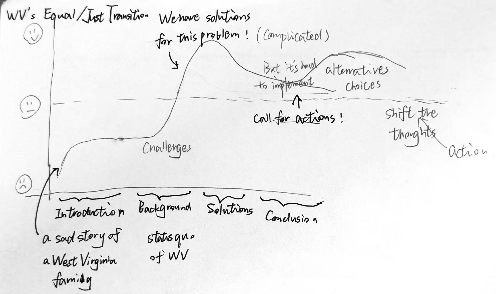
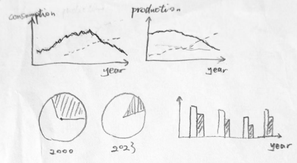
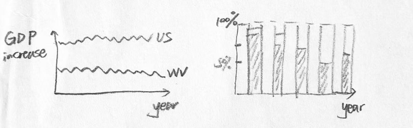
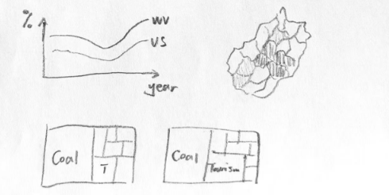

| [home page](https://chengyiing.github.io/cheng-dataviz-portfolio/) | [data viz examples](dataviz-examples) | [critique by design](critique-by-design) | [final project I](final-project-part-one) | [final project II](final-project-part-two) | [final project III](final-project-part-three) |

# Outline
**High-Level Summary**

West Virginia has long been dependent on coal mining as a cornerstone of its economy, but the decline of the coal industry has left the state facing significant challenges. Unemployment rates have surged, poverty levels remain high, and the local economy struggles to diversify. While some regions in the United States have embraced cleaner energy transitions and reaped their benefits, West Virginia lags behind due to outdated energy policies and insufficient attention to environmental justice. This project seeks to address these issues by exploring actionable solutions that balance economic recovery with sustainability. By focusing on policy updates, community-driven initiatives, and opportunities for economic diversification—such as tourism, agriculture, and small-scale clean energy projects—the project will present a balanced approach to fostering growth. The overarching goal is to inspire both policymakers and residents to embrace gradual yet meaningful changes that benefit both the environment and local communities.

## Project Structure

**1.Introduction**

The project begins with an emotional introduction designed to immerse the audience in West Virginia 's reality. "All the coal came out of our mountains. My grandparents and uncles powered half the world with electricity. But now, we're left with nothing but poverty." A girl said. (Attach a [YouTube video](https://www.youtube.com/watch?v=S_ujv0emOuI)). This emotional opening will set the tone for the rest of the presentation, and introduce the audience to West Virginia's current situation.

**2. Background**

Then the section would provide context on West Virginia's dependence on coal and its socioeconomic challenges.
Since the 19th century, coal has been a driving force behind industrialization in the state, contributing significantly to government revenue and local economies. However, as demand for coal declined in the late 20th century, West Virginia 's single-industry economy began to falter. Today, the current issues include unemployment, poverty, lack of economic diversification. It highlights the urgent need for diversification and sustainable development.

**3. Problem Statement**

This section wants to state the problem and warn about the consequences of ignoring environmental justice and failing to transition.
Ignoring environmental justice and delaying energy transition efforts could have dire consequences for West Virginia. Maintaining dependence on coal will only exacerbate existing socioeconomic issues, leading to higher long-term costs for communities already facing significant challenges.

**4. Proposed Solutions**

The project outlines two key areas for action: policy recommendations for decision-makers and community-driven initiatives for residents. Policymakers must prioritize updating West Virginia 's outdated energy policies by integrating environmental justice principles and redirecting resources toward affected communities. For residents, opportunities such as developing tourism initiatives, promoting local agriculture, and introducing small-scale clean energy projects can provide alternative paths to economic recovery. These solutions aim to balance gradual change with tangible benefits for all stakeholders.

(Note:
 My initial project’s goal and solution only targets policymakers, like:
 - Update West Virginia's outdated energy policies (e.g., adopt a new five-year energy plan).
 - Integrate environmental justice into policy decisions.
 - Redirect resources toward communities most affected by the decline of coal.

However, after an interview with a classmate coming from West Virginia, she told me my solutions are a little bit radical and hard to accept for residents who live on coal industry for many years. So I aim to broaden my story line, which is like:

As a coal worker or community resident, you may be skeptical of the transition, which is completely understandable. Transformation does take time and is challenging. But that doesn't mean we don't have other options. In fact, there is much potential to be tapped:
 - Develop tourism initiatives leveraging West Virginia's natural beauty.
 - Promote local agriculture and specialty food industries.
 - Introduce small-scale clean energy projects (e.g., solar farms).      )

**5. Conclusion: A Vision for the Future**

The final section reemphasizes optimism and collaboration. Transitioning away from coal does not mean abandoning tradition; rather, it represents an opportunity to build a more resilient economy rooted in diverse industries. By working together—policymakers, residents, and organizations—West Virginia can achieve both economic recovery and environmental sustainability while honoring its unique cultural heritage.

## Initial sketches

1. **Overall Trend**
 - Coal consumption (compare US/other states and WV to highlight the overall decreasing trend) (Line chart/bar chart)
 - Coal production (compare US/other states and WV to highlight the overall decreasing trend)
 - Proportion of coal in total electricity generation (Pie chart to highlight the smaller percentage)

2. **WV's economic status**
 - GDP increase rate (compare US/other states and WV to highlight the lagged condition of WV)
 - WV electricity generation share (show the trend of coal and other energy contributions)

3. **WV social status**
 - Cancer rate (highlight the bad health level of WV compared with US)
 - Income level within WV (Use map to show the overall state's conditions)
 - Share of different industris (show the opportunity of diversity)

# The data
Some data sources provisionally found include:

1. **Coal Industry Data** (e.g. energy consumption, energy production...):
 - U.S. Energy Information Administration (EIA). [https://www.eia.gov/coal/](https://www.eia.gov/coal/)

2. **Socioeconomic Data** (e.g. unemployment rates, poverty levels...): 
 - U.S. Census Bureau. [https://www.census.gov/library/stories/state-by-state/west-virginia.html](https://www.census.gov/library/stories/state-by-state/west-virginia.html)
 - Statista. [https://www.statista.com/statistics/1042282/west-virginia-state-local-government-debt/](https://www.statista.com/statistics/1042282/west-virginia-state-local-government-debt/)

3. **The opportunities of economic diversification**:
 - West Virginia Department of Tourism. [https://wvtourism.com/information-and-press/tourism-partners/industry-resources/research-reports/](https://wvtourism.com/information-and-press/tourism-partners/industry-resources/research-reports/)
 - United States Department of Agriculture. [https://data.nass.usda.gov/Statistics_by_State/West_Virginia/index.php](https://data.nass.usda.gov/Statistics_by_State/West_Virginia/index.php)

# Method and medium

For this project, I plan to use a combination of tools introduced in class:
1. **Excel/Python**: Do data cleaning/preprocessing/analysis.
2. **Tableau/Datawrapper/Python**: To design dynamic data visualizations that highlight key trends.
3. **Shorthand**: To create an interactive narrative that integrates text, videos, and data visualizations into a cohesive story.
4. **GitHub**: Host my project documentation.

## References
 - Carley, S., Engle, C., & Konisky, D. M. (2021). An analysis of energy justice programs across the United States. Energy Policy, 152, 112219. https://doi.org/10.1016/j.enpol.2021.112219
 - Columbia University Center on Global Energy Policy. (2023). Risk of fiscal collapse in coal-reliant communities. Retrieved September 11, 2024, from https://www.energypolicy.columbia.edu/publications/risk-fiscal-collapse-coal-reliant-communities/
 - Energy Efficient West Virginia. (2013). Energy Plan: 2013-2017. Retrieved September 11, 2024, from https://www.energywv.org/assets/files/EnergyPlan/ENERGY_5year_Plan_ALL-2013-2017.pdf
 - Harris, D. M., & McCarthy, J. (2023). A just transition to what, for whom, and by what means? Transition technology, carbon markets, and an Appalachian coal mine. Energy Research & Social Science, 106, 103307. https://doi.org/10.1016/j.erss.2023.103307
 - Morris, A. (2016). Build a better future for coal workers and their communities. Brookings Institution. https://www.brookings.edu/wp-content/uploads/2016/04/build-a-better-future-for-coal-workers-and-their-communities-morris-updated-071216.pdf
 - USAFacts. (n.d.). West Virginia economy. Retrieved September 11, 2024, from https://usafacts.org/topics/economy/state/west-virginia/
West Virginia Legislature. (n.d.). Code of West Virginia. Retrieved September 11, 2024, from https://code.wvlegislature.gov/5B-2F-2/

